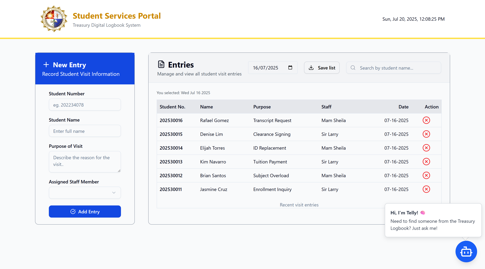

# Treasury Logbook

A digital logbook system for the treasury department, designed to help record students that inquire about their financial assistance.



## Features

- Basic CRD System (Create, Read, Delete System)
- Built with **React**, **TailwindCSS**, **Supabase**, and **shadcn/ui**
- Follows software engineering best practices
> 🚀 **New! TELLY telly AI Assistant:**  
> - Instantly find students in the logbook with the built-in AI-powered search assistant.  
> - Just type a name or query—let the AI do the rest!

## Project Structure

- `components/ui/`  
  Contains reusable UI components from shadcn/ui.

- `components/SectionInputs.jsx`  
  Handles student inputs and actions.

- `components/SectionDisplay.jsx`  
  Displays data fetched from the database.

- `App.jsx`  
  Main entry point that composes all sections.

## Notes

- shadcn/ui components are used similarly to their native HTML counterparts (e.g., `<Button onClick={...} />`).
- The system is structured for maintainability and scalability.

## Getting Started

To set up and run the project locally:

1. **Clone the repository**
    ```bash
    git clone <repository-url>
    cd <repository-directory>
    ```

2. **Install dependencies**
    ```bash
    npm install
    ```

3. **Start the development server**
    ```bash
    npm run dev
    ```
    ## Enabling AI Functionality

    To use the built-in AI-powered search assistant (Telly), follow these steps:

    ### 1. Install AI Dependencies

    First, install the main project dependencies:

    ```bash
    npm install
    ```

    Then, set up the AI module:

    ```bash
    cd ai
    npm install
    ```

    ### 2. Configure API Key

    Create/In your existing `.env` file in your root folder, add your Gemini API key:

    ```env
    GEMINI_API_KEY=<your-api-key>
    ```

    ### 3. Start the AI Server

    IF From the project root:

    ```bash
    node ai/server.js
    ```

    Or, from inside the `ai` folder:

    ```bash
    node server.js
    ```

    You should see:

    ```
    AI server running on http://localhost:PORT
    ```

    ### 4. Run the Frontend

    Return to the project root and start the frontend development server:

    ```bash
    npm run dev
    ```

    Telly AI Assistant is now enabled and ready to help you search the logbook!

---
